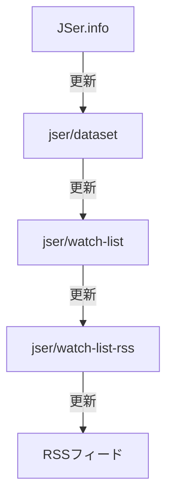

# [JSer.info Watch List RSS](https://jser.info/watch-list-rss/)

[JSer.info Watch List](https://jser.info/watch-list/)を元にして、サイトの更新を一つのRSSフィードにまとめたものを公開しています。

- サイト: [JSer.info Watch List RSS](https://jser.info/watch-list-rss/)
- RSSフィード: <https://jser.info/watch-list-rss/feeds/rss.xml>

JSer.info Watch Listは、JSer.infoで2年以内に紹介したサイトをまとめたものです。
紹介した回数と共にまとめることで、生きているJavaScript情報源を紹介することが目的のサイトです。

- [jser/watch-list: A collection of items that are explained in JSer.info.](https://github.com/jser/watch-list)

[JSer.info Watch List RSS](https://jser.info/watch-list-rss/)では、JSer.info Watch Listのサイトの更新を一つのRSSフィードにまとめています。一つのRSSフィードを購読するだけで、JSer.infoの情報源の更新を知ることができます。

## 仕組み

1. JSer.infoでサイトを紹介する
2. [jser/dataset](https://github.com/jser/dataset): JSer.infoで紹介したサイトの一覧を扱うデータセットが更新される
3. [jser/watch-list](https://github.com/jser/watch-list): データセットを元にRSSフィードを取得、OPMLを生成
4. [jser/watch-list-rss](https://github.com/jser/watch-list-rss): watch-listのサイトごとのRSSを取得、結果を一つのRSSフィードにまとめる



## 開発

このプロジェクトは [yamadashy/tech-blog-rss-feed](https://github.com/yamadashy/tech-blog-rss-feed) をベースにしています。

### 仕組み
GitHub Actions で定期的に更新されており、サイトの生成は [Eleventy](https://www.11ty.dev/) を使用しています。

### 開発環境とコマンド
環境
- Node.js >= 20

パッケージのインストール
```bash
$ npm install
```

フィード生成とサイト立ち上げ
```bash
$ # フィードを取得して作成
$ npm run feed-generate

$ # localhost:8080 で確認
$ npm run site-serve
```

コードのチェック
```bash
$ # lint
$ npm run lint

$ # テスト
$ npm run test
```

## ライセンス
MIT
